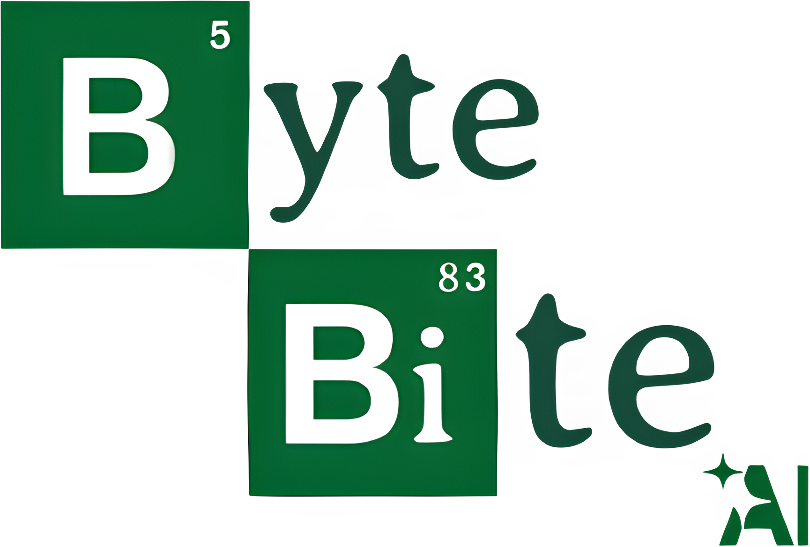
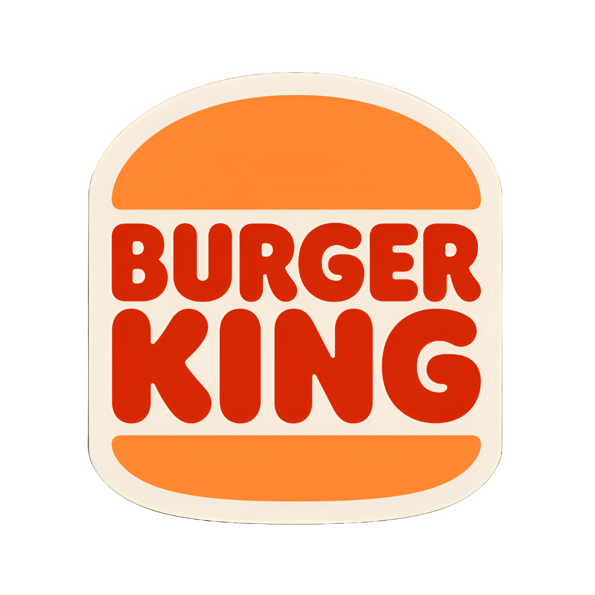
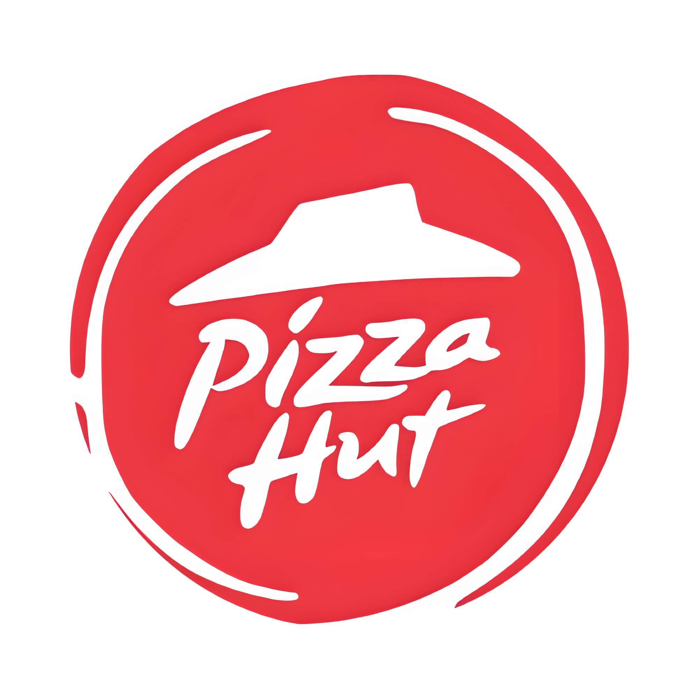
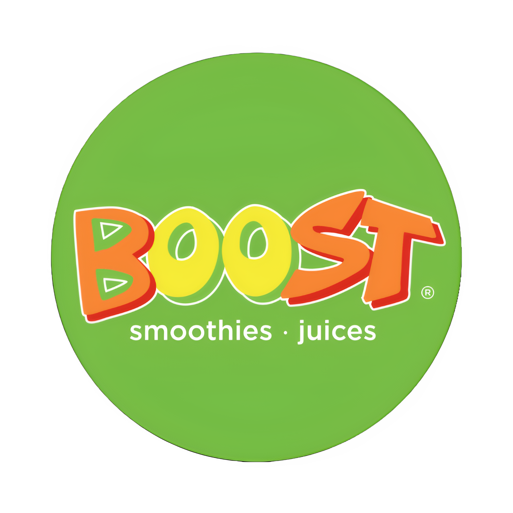
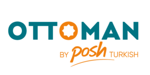

# Byte Bite-AI

**Byte Bite-AI** is an AI-driven healthy eating assistant designed to provide personalized dietary recommendations to university students, with a special focus on social dining experiences. Built on **Python Flask**, Byte Bite-AI leverages federated learning to ensure user privacy while offering dietary suggestions for a variety of dining options available at Campus Hub, including popular brands such as Burger King, Pizza Hut, Cafe Cuba, and Starbucks.


## Promo Video - Click Below Logo

[](https://youtu.be/rla5KahQGGI)

## Key Features

- **Personalized Recommendations**: Byte Bite-AI analyzes individual dietary preferences and makes recommendations tailored to user needs.
- **AI-Powered Decision-Making**: The system integrates Explainable AI (XAI) to enhance transparency in dietary suggestions.
- **Multi-Platform Support**: Works seamlessly across desktop and mobile web interfaces.
- **Chatbot Assistance**: AI-driven chatbot to provide real-time meal suggestions and answer nutrition-related queries.
- **Augmented Reality (AR) Integration**: Uses **Google Teachable Machine** to recognize restaurant logos and display nutritional insights.
- **Data Privacy**: With federated learning, user data remains secure and is processed locally.
- **Dining Insights**: Real-time suggestions from 8 dining options at Campus Hub, facilitating healthy eating in social settings.
- **Profil11e & Goal Tracking**: Allows users to track their weight and progress towards dietary goals.
- **Scalable Design**: Built with a modular architecture that allows for future expansions.

## Technical Details

- **Frontend**: HTML, CSS, JavaScript with localStorage for data management.
- **Backend**: Python Flask for serving dynamic content and handling user data.
- **Data Storage**: User credentials and preferences are stored securely in JSON files and localStorage for seamless user experience.
- **AI & Machine Learning**:
  - Utilizes **rule-based AI** for meal recommendations.
  - Employs **Orca-Mini (via Ollama)** for chatbot responses.
  - Uses **Google Teachable Machine** for AR-powered food recognition.
- **Security & Privacy**:
  - Implements password hashing and secure session tracking.
  - Ensures AI-generated responses do not access or store personal data.

## Motivation

The main motivation behind **Byte Bite-AI** is to encourage healthy eating habits among University of Malta students. Recognizing the difficulties students face in balancing a healthy lifestyle with academic and social obligations, Byte Bite-AI offers a **smart solution** to make healthier choices more accessible and simple.

By integrating intelligent dietary recommendations, Byte Bite-AI hopes to create an engaging and intuitive interface. This assistant enables students to make **informed, health-conscious dining decisions** with friends by providing **personalized guidance in real time**, thereby supporting both individual wellness goals and a healthier campus culture.

## Outlets which Byte Bite-AI Works On

<p align="center">
  
  
  
  
  
  
  
  
</p>

## Clone the repository:
  ```bash
    git clone https://github.com/AFLucas-UOM/Byte-Bite-AI.git
  ```

## To Start the Server for Local Devices
  ```bash
  flask --app flask-app run --host=0.0.0.0 --port=2000
  ```

## Future Work

Byte Bite-AI aims to expand its functionality with the following features:

- Native iOS & Android App: Development of a standalone mobile application.
- Federated Learning Implementation: Enhancing recommendation accuracy without compromising user privacy.
- Expanded AR Features: Integrating AI-powered real-time food classification and calorie tracking.
- Chatbot Enhancements: Improving response accuracy and personalization for meal suggestions.
- Partnerships with Restaurants: Direct collaboration for menu updates and healthy food promotions.

## Acknowledgments

This project was developed as part of the `ICS3211` course at the `University of Malta`.

## Contact

For inquiries or feedback, please contact [Andrea Filiberto Lucas](mailto:andrealucasmalta@gmail.com) & [Sean David Muscat](mailto:seanmuscat@outlook.com)
