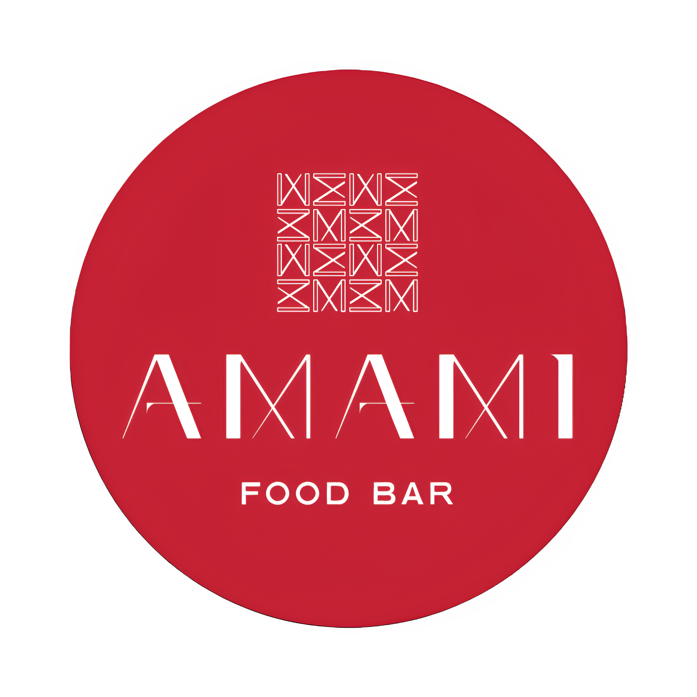

# Byte Bite-AI

**Byte Bite-AI** is an AI-driven healthy eating assistant designed to provide personalized dietary recommendations to university students, with a special focus on social dining experiences. Built on **Python Flask**, Byte Bite-AI leverages federated learning to ensure user privacy while offering dietary suggestions for a variety of dining options available at Campus Hub, including popular brands such as Burger King, Pizza Hut, Cafe Cuba, and Starbucks.


## Promo Video - Click Below Logo

[](https://youtu.be/rla5KahQGGI)

## Key Features

- **Personalized Recommendations**: Byte Bite-AI analyzes individual dietary preferences and makes recommendations tailored to user needs.
- **Data Privacy**: With federated learning, user data remains secure and is processed locally.
- **Dining Insights**: Real-time suggestions from 8 dining options at Campus Hub, facilitating healthy eating in social settings.

## Technical Details

- **Frontend**: HTML, CSS, JavaScript with localStorage for data management.
- **Backend**: Python Flask for serving dynamic content and handling user data.
- **Data Storage**: User credentials and preferences are stored securely in JSON files and localStorage for seamless user experience.

## Motivation

The main motivation behind **Byte Bite-AI** is to encourage healthy eating habits among University of Malta students. Recognising the difficulties students face in balancing a healthy lifestyle with academic and social obligations, Byte Bite-AI offers a clever solution to make healthier choices more accessible and simple.

By integrating intelligent dietary recommendations, Byte Bite-AI hopes to create an engaging and intelligent interface. This assistant enables students to make informed, health-conscious dining decisions with friends by providing personalised guidance in real time, thereby supporting both individual wellness goals and a healthier campus culture.

## Outlets which Byte Bite-AI Works On

<p align="center">
  
  
  
  
  
  
  
  
</p>

## Clone the repository:
  ```bash
    git clone https://github.com/AFLucas-UOM/Byte-Bite-AI.git
  ```

## To Start the Server for Local Devices
  ```bash
  flask --app flask-app run --host=0.0.0.0 --port=2000
  ```

## Acknowledgments

This project was developed as part of the `ICS3211` course at the `University of Malta`.

## Contact

For inquiries or feedback, please contact [Andrea Filiberto Lucas](mailto:andrealucasmalta@gmail.com) & [Sean David Muscat](mailto:seanmuscat@outlook.com)
